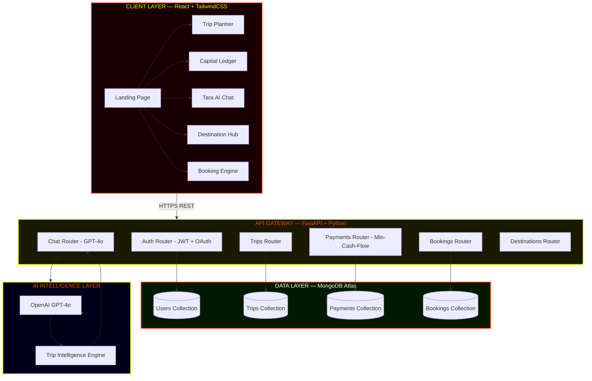
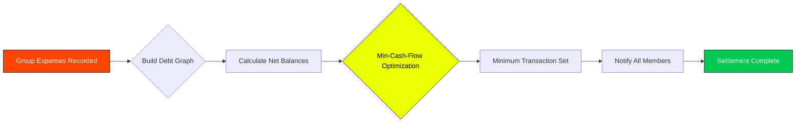

<div align="center">


<!-- ANIMATED TYPING HEADLINE -->
<a href="https://github.com/SayAn1-dls/travelo_main">
  
</a>

<br/>

<!-- ELITE BADGE ROW -->
<p>
  
  
  
  
  
</p>

<br/>

<!-- LIVE ACTIVITY MARQUEE -->
<p>
  <picture>
    
  </picture>
  &nbsp;
  
  &nbsp;
  
  &nbsp;
  
</p>

</div>

---

<!-- SCROLLING MARQUEE -->
<div align="center">
<table border="0" width="100%"><tr><td align="center">

✈️ &nbsp; **TRAVELO** &nbsp; • &nbsp; ✈️ &nbsp; Capital Ledger &nbsp; • &nbsp; 🌍 &nbsp; Tactical Trip Planner &nbsp; • &nbsp; 🤖 &nbsp; GPT-4o Intelligence &nbsp; • &nbsp; 🏔️ &nbsp; Global Redirection Core &nbsp; • &nbsp; 💸 &nbsp; Min-Cash-Flow Engine &nbsp; • &nbsp; 🎯 &nbsp; Destination Hub &nbsp; • &nbsp; 🚀 &nbsp; FastAPI Backend &nbsp; • &nbsp; ⚡ &nbsp; React Frontend &nbsp; • &nbsp; ✈️ &nbsp; **TRAVELO**

</td></tr></table>
</div>

---

<br/>

<!-- HERO IMAGE -->
<div align="center">
  
  <br/>
  <sub><i>The world is your ledger. Travelo is your pen.</i></sub>
</div>

<br/>

---

## 🔥 What Is TRAVELO?

> **Travelo** is not a travel app. It is an **Institutional-Grade Travel Intelligence Platform** — engineered for those who move fast, split smart, and explore without limits.
>
> Built on a **React + FastAPI + MongoDB** core, powered by **GPT-4o**, Travelo is the only tool you need from "let's go" to "we're settled up."

<br/>

<div align="center">
<table>
<tr>
<td align="center" width="25%">

### 💸 Capital Ledger
**Min-Cash-Flow Debt Settlement Engine**

Automatically calculates the fewest possible transactions to settle group expenses. No arguments. No awkward "you owe me" texts. Just clean settlement.

</td>
<td align="center" width="25%">

### 🗺️ Tactical Planner
**Elite Trip Architecture**

Multi-day itinerary builder with destination intelligence. Every leg of the journey — flights, stays, activities — tracked in one command center.

</td>
<td align="center" width="25%">

### 🤖 Intelligence Concierge
**GPT-4o Native AI Layer**

Meet **Tara** — your AI travel co-pilot. Ask her anything: "Best street food in Bangkok?", "Reroute us to avoid rain?" She knows. She adapts.

</td>
<td align="center" width="25%">

### 🌐 Global Redirection Core
**Dynamic Destination Hub**

Real-time destination cards with imagery, travel tips, and booking hooks. Discover the world without leaving the dashboard.

</td>
</tr>
</table>
</div>

<br/>

---

## 🏗️ System Architecture



<br/>

---

## ⚡ Min-Cash-Flow Algorithm — How It Works



> Instead of N*(N-1) transactions in a naive split, Travelo's algorithm reduces the settlement to the **mathematical minimum** — so your squad can focus on the next adventure, not the last bill.

<br/>

---

## 🛠️ Tech Stack — The Arsenal

<div align="center">

<table>
<tr>
  <td align="center" width="16%">
    <br/>
    <b>React 19</b><br/>
    <sub>Frontend Core</sub>
  </td>
  <td align="center" width="16%">
    <br/>
    <b>TailwindCSS</b><br/>
    <sub>Hyper UI Layer</sub>
  </td>
  <td align="center" width="16%">
    <br/>
    <b>FastAPI</b><br/>
    <sub>API Gateway</sub>
  </td>
  <td align="center" width="16%">
    <br/>
    <b>MongoDB</b><br/>
    <sub>Data Layer</sub>
  </td>
  <td align="center" width="16%">
    <br/>
    <b>Python 3.11</b><br/>
    <sub>Backend Engine</sub>
  </td>
  <td align="center" width="16%">
    <br/>
    <b>Vercel</b><br/>
    <sub>Deployment</sub>
  </td>
</tr>
<tr>
  <td align="center">
    <br/>
    <b>Git</b><br/>
    <sub>Version Control</sub>
  </td>
  <td align="center">
    <br/>
    <b>GitHub</b><br/>
    <sub>Repository</sub>
  </td>
  <td align="center">
    <br/>
    <b>JavaScript ES2024</b><br/>
    <sub>Frontend Logic</sub>
  </td>
  <td align="center">
    <br/>
    <b>Node.js</b><br/>
    <sub>Build Runtime</sub>
  </td>
  <td align="center" colspan="2">
    <br/>
    <b>GPT-4o</b><br/>
    <sub>AI Intelligence Layer</sub>
  </td>
</tr>
</table>

</div>

<br/>

---

## 🚀 Quick Launch — Get It Running In 60 Seconds

```bash
# 1. Clone the masterpiece
git clone https://github.com/SayAn1-dls/travelo_main.git
cd travelo_main

# 2. Launch the Masterpiece
npm install
npm start
```

> **Frontend** → `http://localhost:3000`  
> **Architecture** → v4.0 Root Masterpiece

<br/>

---

## 📁 Repository Blueprint

```
travelo_main/
│
├── 📁 src/                       # React Core Logic
│   ├── 📁 pages/                 # 🏠 Landing, 📊 Dashboard, 🗺️ Trips
│   ├── 📁 components/            # 🤖 Tara Chat, ⚡ Navbar
│   └── 📁 lib/                    # 💸 Local Persistence Engine
│
├── 📁 public/                    # Static Assets + index.html
│
├── 📄 package.json                # Dependency Command Center
├── 📄 tailwind.config.js          # Silicon Brutalist Design Tokens
├── 📄 vercel.json                 # Deployment Logic
└── 📄 README.md                   # ← YOU ARE HERE
```

<br/>

---

## 💥 Feature Showcase

<div align="center">

| Module | Description | Status |
|--------|-------------|--------|
| 🏠 **Landing Page** | Full-screen hero with animated travel visuals |  |
| 💸 **Capital Ledger** | Min-Cash-Flow group expense settlement |  |
| 🗺️ **Trip Planner** | Multi-day itinerary with member management |  |
| 🤖 **Tara AI** | GPT-4o powered travel intelligence concierge |  |
| 🌍 **Destination Hub** | Curated destination cards with smart filters |  |
| 🎟️ **Booking Engine** | Trip booking and ticket management system |  |
| 📨 **Squad Mail** | Internal squad communication gateway |  |
| 📊 **Dashboard** | Personal travel command center |  |

</div>

<br/>

---

## 🌐 Live Deployment

<div align="center">

| Layer | Platform | Status |
|-------|----------|---------|
| 🖥️ **Frontend** | Vercel Edge Network |  |
| ⚡ **Backend API** | Vercel Serverless Functions |  |
| 🗄️ **Database** | MongoDB Atlas (M0 Free Tier) |  |
| 🤖 **AI Layer** | Emergent LLM Gateway → GPT-4o |  |

</div>

<br/>

---

## 🤝 Contributing

```bash
# Fork → Clone → Branch → Build → Push → PR
git checkout -b feat/your-goated-feature
git commit -m "🔥 feat: add [feature name]"
git push origin feat/your-goated-feature
```

All PRs are welcome. Keep the code institutional-grade.

<br/>

---

## 📊 GitHub Analytics

<div align="center">
  
</div>

<br/>

---

## 👑 Built By

<div align="center">


### **SayAn1-dls**
*Full Stack Engineer — Building Institutional-Grade Experiences*

[](https://github.com/SayAn1-dls)

</div>

<br/>

---

<div align="center">


<br/>

**Built with 🔥 by SayAn1-dls — For the Elite Traveler.**

*If you made it this far — you're already one of us. Star the repo. Ship the trip.*

[](https://github.com/SayAn1-dls/travelo_main)

</div>